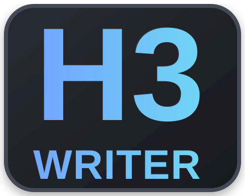
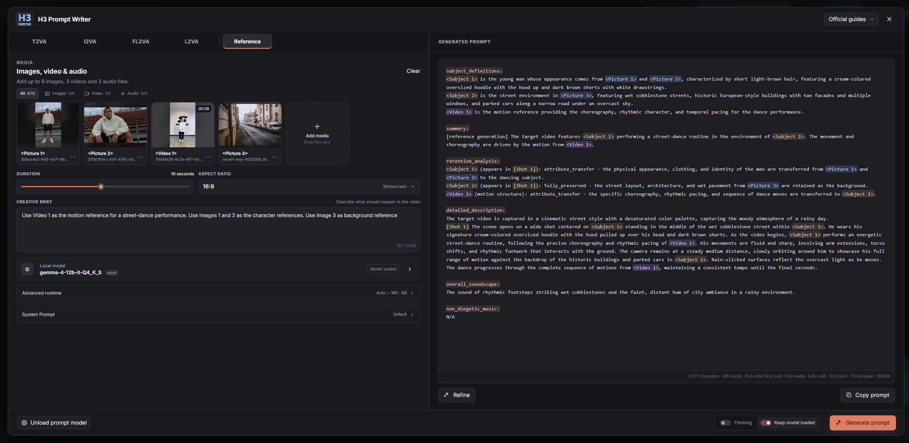

# ComfyUI MiniMax H3 Prompt Writer

<p align="center">
  
</p>

A local multimodal prompt writer for MiniMax H3, hosted inside ComfyUI and powered
by Gemma 4 GGUF models.

Current release: **0.2.1** | [MIT License](LICENSE)

H3 Prompt Writer turns a creative brief plus image, video, and declared audio
references into an editable H3 prompt using the official MiniMax prompt-writing
guides. Media stays on the local machine.

> H3 Prompt Writer is a ComfyUI UI extension, not a workflow node. It creates prompts;
> it does not run MiniMax H3 or queue a workflow.



## Features

- T2VA, I2VA, FL2VA, L2VA, and Reference modes.
- Up to 9 pictures, 3 videos, and 3 audio references in Reference mode.
- Ordered video contact sheets with Auto, 6-frame, and 8-frame sampling.
- Local Gemma 4 multimodal inference through `llama-cpp-python`.
- Optional connection to an existing local OpenAI-compatible `llama.cpp` server.
- Automatic 8K/16K context selection with manual 8K/16K/24K controls.
- Editable output, copy, text-only Refine, Cancel, and contextual GPU-memory control.
- Official MiniMax guide selection and a user-editable Advanced System Prompt.

## Choose a model

| GPU VRAM | Tested model tier | Starting context | Notes |
| --- | --- | --- | --- |
| 8 GB | Gemma 4 E4B Q3_K_M | 8K | Compatibility tier; reduced visual detail |
| 12 GB | Gemma 4 12B Q4_K_S | 8K | Compact option; 16K has little headroom |
| 16 GB | Gemma 4 12B Q5_K_M | 16K | Full general-purpose tier |
| 24 GB | Gemma 4 26B-A4B Q4_K_M | 16K | Best overall balance observed in local QA |
| 32 GB | Gemma 4 31B Q4_K_XL | 16K | Strong visual detail; slower and not always a better H3 prompt |

These are measured local QA starting points, not hard guarantees. Other ComfyUI
models and desktop applications also consume VRAM. See [Model setup](docs/MODELS.md)
for exact GGUF and projector pairs.

## Quick installation

1. Place this repository at
   `ComfyUI/custom_nodes/ComfyUI-MiniMaxH3-Prompt-Writer`.
2. Install the dependencies with the Python environment used by ComfyUI.
3. Put one model GGUF listed in the model guide and its matching `mmproj` in
   `ComfyUI/models/LLM/`.
   For multiple models, keep each model and its matching projector together in
   a separate subfolder.
4. Restart ComfyUI and open the floating **H3 Prompt Writer** launcher. If it is
   not visible, use **Extensions > H3 Prompt Writer** from the ComfyUI menu.

Windows Portable commands and CUDA runtime notes are in the
[installation guide](docs/INSTALLATION.md).

## How it works

```text
Creative brief + local references
                ↓
Official MiniMax guide + local Gemma 4 vision model
                ↓
Editable MiniMax H3 prompt
                ↓
Copy into your H3 workflow
```

## Current limitations

- Audio files are preserved as declared `<Audio N>` references, but the local
  GGUF model does not listen to their signal. Their role must be stated in the brief.
- Video understanding uses the exact ordered contact sheet shown in the preview,
  not the complete encoded video stream.
- H3 Prompt Writer generates text only and does not modify the workflow graph.
- The v1 interface and documentation are in English. Creative briefs may use
  other languages, and H3 Prompt Writer preserves user-supplied dialogue and visible text.

## Documentation

- [Installation](docs/INSTALLATION.md)
- [Models](docs/MODELS.md)
- [Usage](docs/USAGE.md)
- [Troubleshooting](docs/TROUBLESHOOTING.md)

## Local validation

Tested locally with Gemma 4 E4B, 12B, 26B-A4B, and 31B GGUF models across all
five modes. The external-server path was tested with Gemma 4 26B-A4B and its
matching vision projector on `llama-server`.

External `llama-server` support is currently validated only with Gemma 4
multimodal GGUF models and matching vision projectors. Other models are not
tested or supported in v0.2.0.

MiniMax H3 prompt guides are vendored from the official MiniMax H3 repository;
model files are provided by their respective Hugging Face repositories and are
not bundled with this extension.
