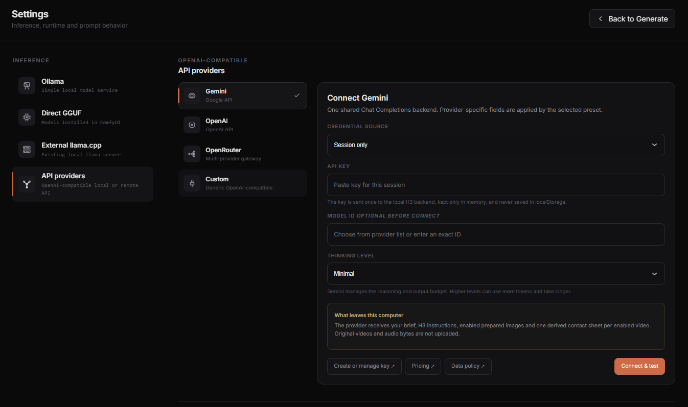

# API providers

API providers use one OpenAI-compatible Chat Completions backend with presets for Gemini, OpenAI, OpenRouter, and Custom endpoints.



## Choose a preset

- **Gemini** uses Google's OpenAI-compatible endpoint and exposes Gemini Thinking levels.
- **OpenAI** uses the OpenAI API preset.
- **OpenRouter** sends requests through OpenRouter to an upstream model provider.
- **Custom** accepts a generic OpenAI-compatible URL, including local LM Studio.

Gemini was validated live. The shared Custom transport was validated live with LM Studio. OpenAI and OpenRouter contract tests cover request serialization, model listing, streaming, cancellation, errors, and secret handling, but no credentialed live smoke was run for those two services.

The API provider path is not tied to Gemma 4. You can choose another multimodal model when the provider accepts image inputs in a format Writer supports. A successful connection shows that Writer can reach the model, but it does not guarantee a good H3 prompt.

## Connect

1. Open **H3 Prompt Writer > Settings > API providers**.
2. Choose a preset.
3. Paste the API key for the current Writer session. Custom endpoints may be used without a key.
4. Optionally enter an exact Model ID before connecting.
5. Select **Connect & test**, then choose a vision-capable model from the provider list or enter its exact ID.

Model availability, pricing, quotas, rate limits, and input support belong to the provider and selected model. Check the policy and pricing links shown in Settings.

## Gemini Thinking

Gemini supports these Writer levels:

- Minimal
- Low
- Medium
- High

Gemini manages its reasoning and output budget. Higher levels can consume more tokens and take longer. The general Thinking switch on Generate is hidden for API providers so it does not conflict with the provider-specific setting.

## Custom and LM Studio

For LM Studio, use a base URL such as:

```text
http://localhost:1234/v1
```

Load a vision model in LM Studio, connect the Custom preset, and choose the model. Writer can read LM Studio's local capability metadata when the standard `/v1/models` response does not identify vision support.

For another Custom endpoint, enable **Endpoint accepts image_url inputs** only when the server and model really accept OpenAI-style image content. You can also provide a known context size. A loopback endpoint may use HTTP; a remote Custom endpoint must use HTTPS.

Custom is a transport contract, not a claim that every OpenAI-compatible server or model is supported.

## Keys and saved settings

The key is sent once to the local H3 backend and held only in that ComfyUI process's memory. It is not read from environment variables and is not written to browser storage, model settings, developer notes, or request content. The backend uses it only to authenticate provider requests. Disconnecting removes the in-memory connection. The browser may save the preset, base URL, model ID, Gemini Thinking level, and Custom capability settings.

## What leaves this computer

For a remote provider, Writer sends:

- your Creative Brief;
- H3 and system instructions;
- prepared images in the current mode's manifest;
- one derived contact sheet for each video in that manifest.

Writer does not upload original video bytes or audio bytes. Audio references remain textual entries in the request manifest, so describe their intended role in the brief.

The provider can retain or process requests according to its own policy. OpenRouter can forward the request to an upstream model provider with a separate policy. Review the provider's data policy before sending private media.

## Lifecycle and errors

API providers show **Cancel** for the current Writer request. Writer cannot unload or stop a remote service.

Authentication, billing, rate-limit, safety, and quota errors are returned by the provider. A response that reaches its length limit is rejected rather than displayed as a successful but truncated H3 prompt.

Comfy Cloud has not been validated for v0.3. The existence of an API provider does not establish that the extension, outbound networking, or session-key handling works there.
