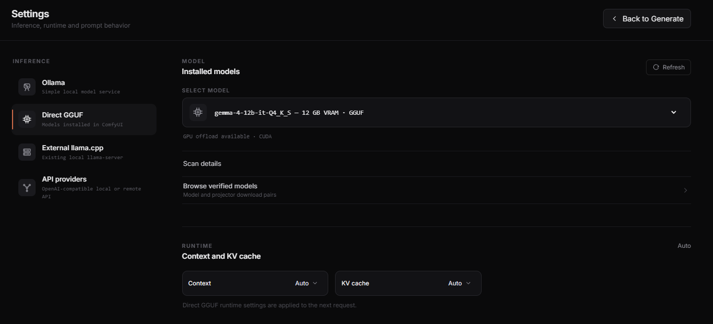

# Direct GGUF

Direct GGUF loads a local multimodal model inside ComfyUI. Choose it when you want Writer to manage model loading, Context, KV cache, and unload without a separate model server.

This is an optional advanced path. Most users should start with [Ollama](OLLAMA.md).



## What you need

- A compatible native `llama-cpp-python` runtime installed in the Python environment that starts ComfyUI.
- One supported model GGUF.
- For image and video-reference modes, the matching multimodal projector (`mmproj`) from the same model class.

A model without an active projector remains usable as text-only Direct GGUF. Writer keeps T2VA and Refine available, disables I2VA, FL2VA, L2VA, Reference, and Music 3, and shows why vision is unavailable.

Workflow safetensors, checkpoints, and text encoders are unrelated to the Direct prompt model.

## Windows Portable with NVIDIA

Open PowerShell or Command Prompt in the ComfyUI Portable folder that contains `python_embeded`, then run:

```powershell
.\python_embeded\python.exe -m pip install --only-binary=:all: --extra-index-url https://abetlen.github.io/llama-cpp-python/whl/cu130 "llama-cpp-python>=0.3.34,<0.4"
```

Restart ComfyUI and open **H3 Prompt Writer > Settings > Direct GGUF**. Settings shows a supported installed package as **Runtime detected**.

This preflight checks that `llama-cpp-python` is installed, its version is supported, and the Python module is available without importing the native runtime. Native compatibility and GPU execution are exercised only when a Direct model is actually loaded and used.

This command was validated on the official NVIDIA Windows Portable build used for v0.3 validation:

- Python 3.13.14
- PyTorch `2.13.0+cu130`
- CUDA 13.0
- `llama-cpp-python 0.3.34`
- `GGML_TYPE_F16` import and CUDA GPU offload
- real multimodal generation and unload

The prebuilt native wheel is not validated for every CPU, CUDA version, Python version, or ComfyUI distribution. Keep `--only-binary=:all:` in the command so an unavailable wheel fails instead of starting an unplanned local C++ build.

## Add a model and optional projector

Open **Browse verified models** in Direct settings. Download the model file and, for visual modes, its projector from the same listed model row. Place them together under:

```text
ComfyUI/models/LLM/
```

Subfolders are supported. For multiple models, keep each model and its matching projector in its own folder:

```text
ComfyUI/models/LLM/
├── gemma-4-12b/
│   ├── gemma-4-12b-it-Q4_K_S.gguf
│   └── mmproj-BF16.gguf
└── gemma-4-26b/
    ├── gemma-4-26B-A4B-it-UD-Q4_K_M.gguf
    └── mmproj-BF16.gguf
```

Do not share an `mmproj` across model classes because the filenames happen to match. Writer enables vision only when it can pair one model GGUF with one projector unambiguously. A missing or ambiguous projector does not hide the model; it leaves the model available in text-only T2VA mode and reports the pairing problem in Direct settings and Scan details.

Select **Refresh** after adding files. Expand **Scan details** if the model does not appear.

## Verified Direct pairs

| Starting GPU tier | Model GGUF | Matching projector |
| --- | --- | --- |
| 8 GB | [Gemma 4 E4B Q3_K_M](https://huggingface.co/unsloth/gemma-4-E4B-it-GGUF/blob/bfc15c382204943c3a8fff0c750b94ae2364d7a3/gemma-4-E4B-it-Q3_K_M.gguf) | [E4B mmproj-BF16](https://huggingface.co/unsloth/gemma-4-E4B-it-GGUF/blob/bfc15c382204943c3a8fff0c750b94ae2364d7a3/mmproj-BF16.gguf) |
| 12 GB | [Gemma 4 12B Q4_K_S](https://huggingface.co/unsloth/gemma-4-12b-it-GGUF/blob/fc034cfff751157913579611efad8462ac1be606/gemma-4-12b-it-Q4_K_S.gguf) | [12B mmproj-BF16](https://huggingface.co/unsloth/gemma-4-12b-it-GGUF/blob/fc034cfff751157913579611efad8462ac1be606/mmproj-BF16.gguf) |
| 16 GB | [Gemma 4 12B Q5_K_M](https://huggingface.co/unsloth/gemma-4-12b-it-GGUF/blob/fc034cfff751157913579611efad8462ac1be606/gemma-4-12b-it-Q5_K_M.gguf) | [12B mmproj-BF16](https://huggingface.co/unsloth/gemma-4-12b-it-GGUF/blob/fc034cfff751157913579611efad8462ac1be606/mmproj-BF16.gguf) |
| 24 GB | [Gemma 4 26B-A4B Q4_K_M](https://huggingface.co/unsloth/gemma-4-26B-A4B-it-GGUF/blob/c099eb48e663fd284577b04978a94ffccb261841/gemma-4-26B-A4B-it-UD-Q4_K_M.gguf) | [26B mmproj-BF16](https://huggingface.co/unsloth/gemma-4-26B-A4B-it-GGUF/blob/c099eb48e663fd284577b04978a94ffccb261841/mmproj-BF16.gguf) |
| 32 GB | [Gemma 4 31B Q4_K_XL](https://huggingface.co/unsloth/gemma-4-31B-it-GGUF/blob/c1ac76e99d5513b141e8adde7288b85c3f9c32ec/gemma-4-31B-it-UD-Q4_K_XL.gguf) | [31B mmproj-BF16](https://huggingface.co/unsloth/gemma-4-31B-it-GGUF/blob/c1ac76e99d5513b141e8adde7288b85c3f9c32ec/mmproj-BF16.gguf) |

These are measured starting tiers, not hard requirements or quality rankings. They are the currently published verified Gemma 4 pairs. Direct also recognizes the `qwen35` and `qwen35moe` runtime architectures from GGUF metadata. A recognized custom configuration is labeled compatible/unverified until that exact model policy and projector combination has been validated; an unknown architecture is visible in Scan details but is not loaded.

## Qwen model policy

Architecture and model policy are separate. `qwen35` and `qwen35moe` select a safe loading/MTMD adapter; they do not by themselves mean Qwen 3.8 or 3.6 and never enable version-specific defaults.

Direct recognizes the exact `Qwen3.8-27B` metadata lineage as a known policy. Thinking uses `temperature 1.0`, `top_p 0.95`, `top_k 20`, `min_p 0`, `presence_penalty 0`, and `repeat_penalty 1.0`; non-thinking uses `0.7`, `0.8`, `20`, `0`, `1.5`, and `1.0`. When both the known policy and embedded template advertise it, Thinking passes `reasoning_effort=low`. The verified local `Qwen3.8-27B-UD-Q4_K_XL.gguf` configuration is distinguished from other policy-compatible but unverified quants.

The exact official `Qwen3.6-35B-A3B` metadata lineage has its own known sampling policy and does not receive `reasoning_effort`. A renamed or fine-tuned `qwen35`/`qwen35moe` model remains custom/unverified and uses the generic Direct fallback instead of inheriting either lineage policy.

Qwen Thinking output is split from the final prompt whether the runtime returns `reasoning_content` separately or emits a completed `</think>` prefix. Private reasoning is never included in the returned H3 prompt. A missing closing tag is treated as truncated Thinking. MTP/`nextn` tensors are detected for diagnostics but intentionally remain disabled.

The validated Qwen adapter floor is `llama-cpp-python 0.3.35`; Gemma remains compatible with the existing 0.3.34 floor. If 0.3.34 is installed, Qwen is discoverable but not runtime-ready and Settings reports the required update before any weights are loaded.

## Context and KV cache

Direct is the only provider with manual Context and KV controls in Writer.

- **Context Auto** chooses the smallest tier that fits the assembled input, complete output budget, and a safety reserve. Gemma keeps its existing 8K/16K/24K choices; Qwen uses 16K/24K/32K/48K, capped by the GGUF's declared native context.
- **KV cache Auto** uses the tested Q8 policy. F16 is available manually.
- A manual context is respected. Writer reports when the request needs a larger tier instead of silently changing it.
- Thinking with Auto reserves the full reasoning and final-output budget before choosing context.
- Qwen text is counted before full load by a cached `vocab_only` tokenizer subprocess. It sets `n_gpu_layers=0` and hides CUDA, so preflight does not allocate model weights or GPU state.
- Qwen visual input is budgeted from the exact prepared image or contact-sheet dimensions and projector patch metadata. Missing dimensions use a conservative fallback instead of silently assuming a small fixed image cost.

The 48K ceiling is deliberate for the current Prompt Writer workload, including the maximum Reference media set. Direct does not automatically request Qwen 3.6's advertised 128K context or its very large possible output budget; Qwen 3.6 Thinking remains unverified until the dedicated live characterization is complete.

Increasing context or using F16 KV consumes more VRAM. If preflight reports insufficient free VRAM, use a smaller model or release other GPU models.

## Model lifecycle

With **Keep model loaded** off, Direct unloads after every request. With it on:

- **Unload Direct** releases the idle Direct model.
- **Stop & unload** cancels the current Direct request and unloads at the next safe backend point.
- **Cancel** stops the request without forcing a previously retained model to unload.

**Free ComfyUI VRAM** is separate. It releases workflow models loaded by ComfyUI, not the Direct prompt model.

## After a ComfyUI update

The normal official `update_comfyui.bat` path was tested. It kept the embedded Python environment, Direct runtime, GPU offload, multimodal generation, and unload working.

If an update replaces `python_embeded` or leaves mixed native packages, reinstall the optional runtime once:

```powershell
.\python_embeded\python.exe -m pip uninstall llama-cpp-python -y
.\python_embeded\python.exe -m pip install --no-cache-dir --only-binary=:all: --extra-index-url https://abetlen.github.io/llama-cpp-python/whl/cu130 "llama-cpp-python>=0.3.34,<0.4"
```

Restart ComfyUI and confirm that Direct reports **Runtime detected**, then complete one real Direct generation. Do not copy native DLLs manually, replace ComfyUI's Python files, or install the package into an unrelated system Python.

If ComfyUI exits during the first Direct load or Windows reports `0xC000001D`, see [Illegal instruction](TROUBLESHOOTING.md#windows-0xc000001d-illegal-instruction). Reinstalling the same wheel repeatedly will not solve a CPU instruction incompatibility.
