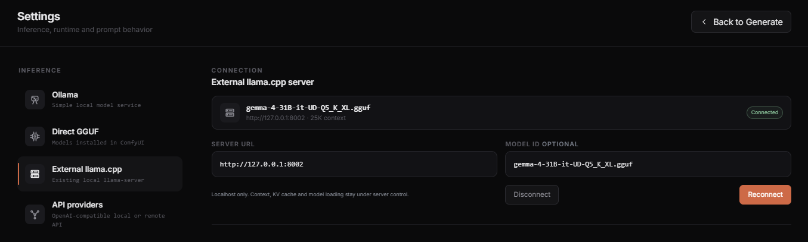

# External llama.cpp server

External llama.cpp is the advanced local provider for users who want to control the inference runtime. It is also an alternative when a Direct `llama-cpp-python` wheel is incompatible with the system.



## Quick setup

1. Get a current `llama-server` from the [official llama.cpp project](https://github.com/ggml-org/llama.cpp).
2. Download a multimodal model GGUF and its matching `mmproj`.
3. Start the server from the directory containing `llama-server`:

```powershell
.\llama-server.exe -m "C:\models\model.gguf" --mmproj "C:\models\mmproj.gguf" --host 127.0.0.1 --port 8080 --ctx-size 24576 --alias h3-vision
```

On Linux or macOS, use `./llama-server` and the appropriate file paths.

4. Open **H3 Prompt Writer > Settings > External llama.cpp**.
5. Enter `http://127.0.0.1:8080` as **Server URL**.
6. Leave **Model ID** empty when the server exposes one model. If it exposes several, enter the exact `/v1/models` ID or the value passed with `--alias`.
7. Select **Connect**, return to Generate, and run a real image request.

The command uses current official llama.cpp options. Adjust context, GPU layers, cache types, and other runtime settings for your hardware. The server's default host is loopback and its default port is 8080.

## What Writer controls

Writer prepares the brief, H3 instructions, images, and video contact sheets. It sends a Chat Completions request and can cancel its active HTTP request.

The external server controls:

- model and projector loading;
- GPU placement and offload;
- context size and KV cache;
- build flags and runtime optimizations;
- server startup, shutdown, sleep, and model unload.

Changing provider, disconnecting, cancelling, or closing Writer does not stop `llama-server` or unload its model.

## Connection contract

Writer accepts local loopback HTTP servers. Use a root URL such as:

```text
http://127.0.0.1:8080
```

Entering `http://127.0.0.1:8080/v1` is also accepted and normalized to the server root. Arbitrary additional paths are rejected.

During connection, Writer checks `/health`, `/props`, and `/v1/models`. A successful text connection is not enough for Reference or image modes: the server must expose vision support from a matching model and projector.

## Advanced use

Use `--alias` when you want a stable API Model ID. Current llama.cpp also supports options such as `--gpu-layers`, `--cache-type-k`, `--cache-type-v`, `--flash-attn`, and `--split-mode`. Keep these on the server command line; Writer does not duplicate them.

External support has been validated with multimodal Gemma 4 GGUF models and matching projectors, but the provider is not restricted to Gemma 4. You can try another vision model supported by your llama.cpp build when the server reports the required capability and uses its matching projector. Compatibility does not guarantee the same H3 prompt quality.

External/API providers only show **Cancel** during a request. Prompt-model unload controls do not apply because Writer does not own their process or model lifetime.
