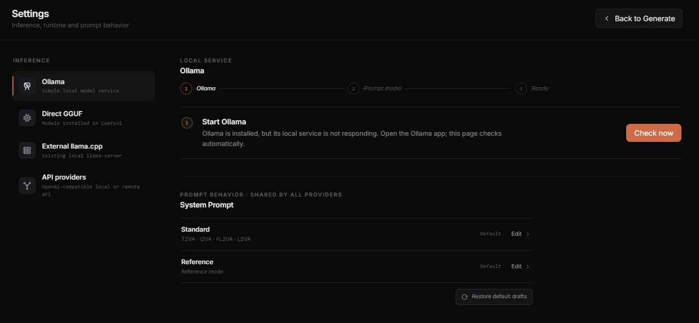

# Ollama

Ollama is the recommended local provider. It keeps the prompt-model runtime outside ComfyUI and avoids the optional Direct GGUF Python wheel.

## Quick setup

1. [Install Ollama](https://ollama.com/download) and open the Ollama app.
2. Choose a starting model for your GPU from the table below.
3. Run its `ollama pull` command in Terminal, PowerShell, or Command Prompt.
4. Open **H3 Prompt Writer > Settings > Ollama**.
5. Select **Check now** if the app is waiting for Ollama to start.
6. After the pull completes, select **Refresh**, choose the installed model, and return to Generate.

Prompt Writer only checks the local Ollama service and installed models. It does not start `ollama serve`, call `/api/pull`, or download models.

## Tested Gemma 4 tags

These are starting recommendations, not guaranteed minimum requirements:

| GPU tier | Tested tag | Command |
| --- | --- | --- |
| Less than 8 GB | `gemma4:e2b` | `ollama pull gemma4:e2b` |
| 8 GB | `gemma4:e4b` | `ollama pull gemma4:e4b` |
| 12-16 GB | `gemma4:12b` | `ollama pull gemma4:12b` |
| 24 GB | `gemma4:26b` | `ollama pull gemma4:26b` |
| 32 GB | `gemma4:31b` | `ollama pull gemma4:31b` |

All five exact tags completed H3 multimodal validation. The measurements were taken on a 32 GB RTX 5090. Actual headroom depends on display use, ComfyUI models, other applications, context size, and Ollama's GPU/CPU placement.

The Writer marks these exact tags **Tested for H3**. Other installed vision models can still appear when Ollama reports compatible capabilities; they are shown as compatible but not H3-tested.

Qwen 3.6 also completed all five H3 modes through Ollama without special changes to Writer. It is not part of the fixed GPU table because those starting tiers come from the measured Gemma 4 runs.

You can try other Ollama vision models when Ollama reports the required image capability. This is an option for experimentation, not a promise that every multimodal model will follow the H3 format equally well.

## Context and Thinking

Ollama has no manual Context or KV cache controls in Writer. Writer estimates the assembled request and sends the smallest sufficient 8K, 16K, or 24K `num_ctx` value, within the selected model's reported limit. Ollama decides the actual GPU and CPU placement.

The **Thinking** switch is available only when the selected Ollama model reports thinking support. When enabled, Auto reserves the larger reasoning and final-output budget before choosing context.

## Model lifecycle

With **Keep model loaded** off, Writer asks Ollama to unload the model after the request. Turn it on when generating several prompts in a row.

- **Unload Ollama** releases an idle Ollama model retained by Writer.
- **Stop & unload** cancels an active Ollama request and asks Ollama to unload that model.
- **Cancel** stops the current request without changing a previously retained model.

Ollama is a shared service. Writer only offers unload controls for models it intentionally used and retained during the current Writer session.

See [Troubleshooting](TROUBLESHOOTING.md#ollama-is-not-running) if the service or model is not detected.
