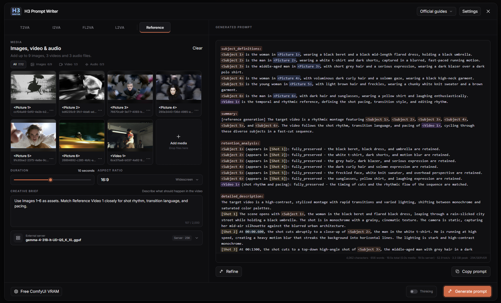

# Usage

## Generate a prompt

1. Open the floating **H3 Prompt Writer** button or use **Extensions > H3 Prompt Writer**.
2. Choose a mode.
3. Add the media required by that mode.
4. Set duration and aspect ratio.
5. Describe the intended video in **Creative Brief**.
6. Choose a ready prompt model in **Settings**.
7. Select **Generate prompt**.
8. Review or edit the generated prompt, then select **Copy prompt** and paste it into your H3 workflow.

Prompt Writer creates text. It does not add nodes, modify the graph, or queue a video workflow.



## Modes

| Mode | Input | How the media is used |
| --- | --- | --- |
| T2VA | Creative Brief only | Writer builds the full audiovisual timeline from text |
| I2VA | One opening image | `<Picture 1>` is the first frame |
| FL2VA | Opening and closing images | `<Picture 1>` is the first frame and `<Picture 2>` is the last frame |
| L2VA | One closing image | `<Picture 1>` is the last frame |
| Reference | Up to 9 images, 3 videos, and 3 audio files; 12 files total | Each active file can provide a specific subject, setting, motion, camera, style, or sound role |

Duration and aspect ratio become part of the request. The generated text remains editable before you copy it.

## Writing a useful Creative Brief

Write what should happen in ordinary language. You do not need to reproduce the official H3 prompt format. Writer builds that structure for you.

A useful brief usually says:

- what happens in the video;
- which reference supplies each important detail;
- what must stay unchanged;
- any exact dialogue, visible text, music, or sound;
- which details from a reference must not transfer.

### T2VA example

T2VA has no media, so describe the scene, action, camera, and sound directly:

```text
A tired baker opens a small street bakery before sunrise. Use one continuous slow push-in as he places the first loaf on the counter and says, "First batch of the morning." Quiet street ambience, wooden shutters and a single doorbell. No background music.
```

### I2VA example

The uploaded image is already the opening frame. Describe what happens next instead of restating every visible detail:

```text
Continue naturally from <Picture 1>. The woman notices a paper boat floating past her feet, follows it along the wet pavement and kneels to pick it up. Keep her appearance, clothes and the evening lighting unchanged. The camera slowly pulls back without a cut.
```

### Reference example

Assign a clear role to each file when several references are active:

```text
Use <Picture 1> for the character's face and hair. Use <Picture 2> only for clothes and <Picture 3> for the rainy tram-stop setting. Use only the slow lateral camera movement and pacing from <Video 1>; do not copy its performer, clothes, background, lighting or audio. The character waits alone, notices an approaching light and turns into the wind. End on a quiet close-up.
```

The roles can be short. Phrases such as `use for appearance`, `clothes only`, `background`, `movement only`, `camera motion only`, and `keep the visible text exactly` are enough when the intent is clear.

Every active file in Reference mode belongs to the request. It does not need to become a main subject, but Writer expects the generated prompt to account for it. Remove a file before generating if it should not participate.

### Audio example

Prompt models do not hear the audio file, so describe what should be taken from it:

```text
Use <Audio 1> as the full soundtrack: slow solo piano with three soft notes followed by a long pause. Use <Audio 2> only as a reference for the narrator's low, breathy voice. Do not copy any words from it.
```

Include a transcript when exact speech or lyrics matter. Writer preserves user-supplied dialogue and visible text rather than asking the prompt model to guess them.

## Images and video

Images are sent to the selected multimodal model in reference order. Reordering media renumbers tags within each type.

For video, Writer prepares an ordered contact sheet. Open a video card to inspect **What the model sees** and choose the available frame-sampling options. The contact sheet still represents the same `<Video N>` reference; it does not create extra `<Picture N>` tags.

Local providers and remote API providers use the prepared contact sheet instead of the original encoded video stream. API providers can receive the derived sheet, but not the original video bytes.

## Audio references

Prompt models do not receive audio bytes. Audio remains a typed `<Audio N>` reference in the request manifest. State its intended role in the brief:

```text
Use <Audio 1> as the full soundtrack.
Use only the rhythm of <Audio 2>; do not copy its voice.
```

Include any transcript, voice description, music style, rhythm, or sound detail that the prompt needs.

## How Reference mode keeps track of media

Every active Reference upload is expected to be accounted for with its exact `<Picture N>`, `<Video N>`, or `<Audio N>` tag. A reference can be background context, motion, style, sound, or another supporting role; it does not need to become a primary subject.

After generation, Writer checks the required format and exact media tags. A valid prompt is returned without being rewritten. If a visual reference tag is missing, Writer can make one correction using the same prepared media. If the correction does not pass the check, Writer keeps the original prompt and shows a warning instead of hiding the problem.

## Refine

Select **Refine** to rewrite the current prompt from a short revision instruction. Refine uses the currently selected provider and model. The previous prompt can be restored after a successful rewrite.

The normal Refine pass works from the current prompt and revision instruction. In Reference mode, Writer checks that the revised result still accounts for the active media.

## Thinking

For Direct GGUF and compatible Ollama models, the **Thinking** switch asks the model to use a larger reasoning budget. Auto context plans for the assembled input, reasoning, and final answer rather than silently shrinking Thinking to save VRAM.

Direct disables Thinking when a manually selected 8K context cannot provide the required budget. Ollama shows the switch only when the model reports thinking support. API reasoning is provider managed; Gemini exposes **Minimal**, **Low**, **Medium**, and **High** in API Settings instead of using the general switch.

If a model still cannot complete Thinking, Writer reports the fallback. It does not present a standard-mode retry as though the full Thinking request succeeded.

## Saved settings and drafts

Writer saves stable preferences in the browser used to open ComfyUI:

- mode, duration, and aspect ratio;
- selected provider and available model preference;
- Direct Context and KV preference;
- Ollama model tag;
- External URL and optional Model ID;
- API preset, URL, model ID, Gemini Thinking level, and Custom capabilities;
- custom Standard and Reference system-prompt overrides.

It never saves API keys. If a saved model no longer exists, discovery falls back without treating the missing model as a fatal error.

Every mode, including Reference, keeps its own Creative Brief and editable prompt draft across a page reload. Uploaded media is session content and is not restored after reload.

In **Settings > Prompt behavior**, select **Restore default drafts**. The button changes to **Click again to confirm** for five seconds. Select it again to delete every saved mode draft. The current mode immediately returns to its current built-in Creative Brief and prompt; the other modes use their current built-in defaults when opened. This includes Reference. Media, provider settings, custom system prompts, and API credentials are not changed.

## System prompts

Prompt behavior is shared by all providers and has two profiles:

- **Standard** for T2VA, I2VA, FL2VA, and L2VA;
- **Reference** for Reference mode.

Editing a profile creates an override of the built-in H3 instruction. It does not replace the separate official MiniMax guide for the selected mode. Resetting an override returns to the current built-in system prompt; there are no separate Standard system prompts for each mode.

## Lifecycle controls

- **Free ComfyUI VRAM** releases workflow models loaded by ComfyUI while preserving cached node results. It is separate from the prompt model.
- **Unload Ollama** releases an idle Ollama model retained by Writer.
- **Unload Direct** releases an idle Direct GGUF model.
- **Cancel** stops the current Writer request.
- **Stop & unload** cancels an active Direct or Ollama request and forces that prompt model to unload at the next safe point.
- **Prompt models · N** groups unload actions when more than one Writer-managed local prompt model remains resident.

**Keep model loaded** applies to Direct and Ollama. It is off by default. External llama.cpp and API providers only use **Cancel** because Writer does not own their server or model lifecycle.

Provider setup details are in [Choose a provider](PROVIDERS.md). Error-specific steps are in [Troubleshooting](TROUBLESHOOTING.md).
